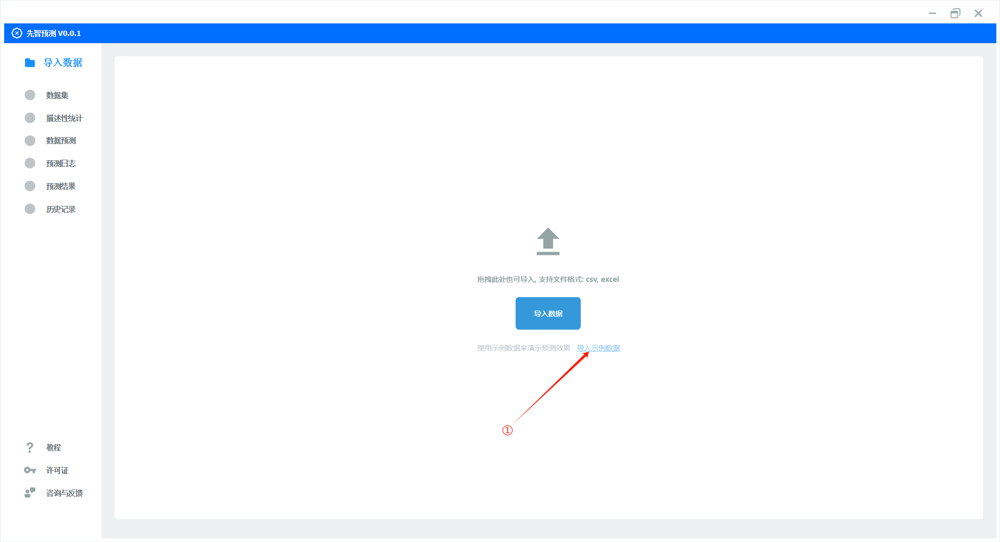
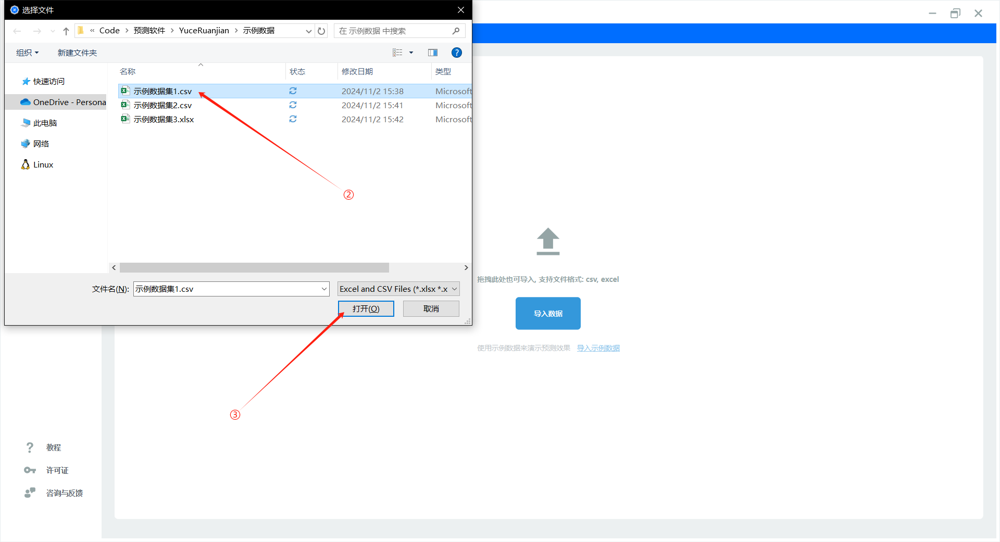
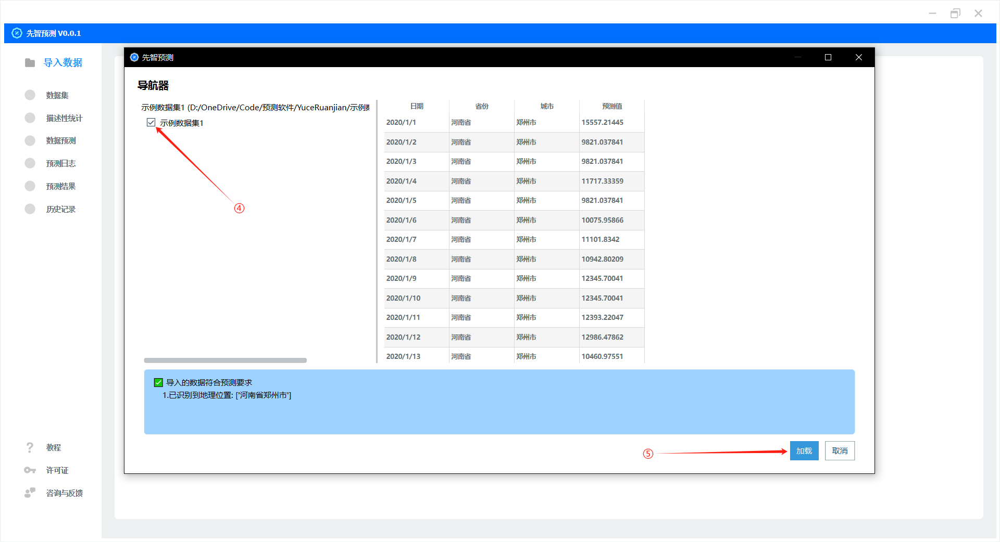
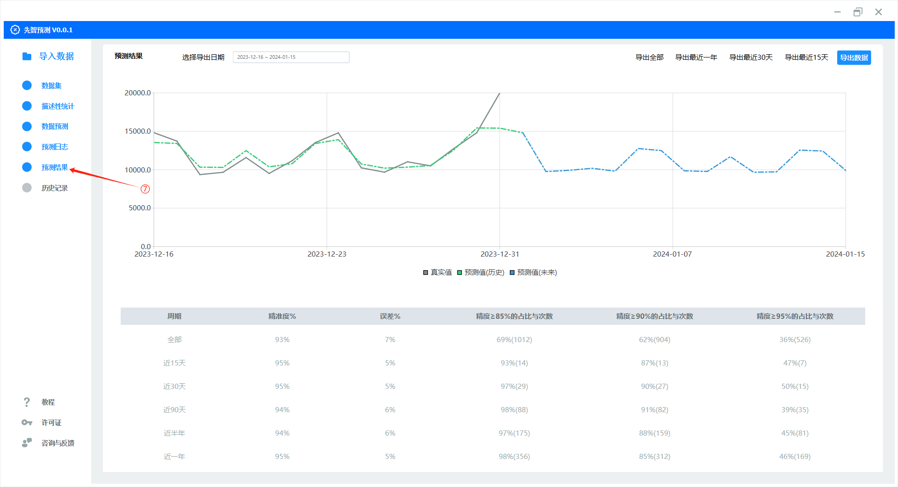
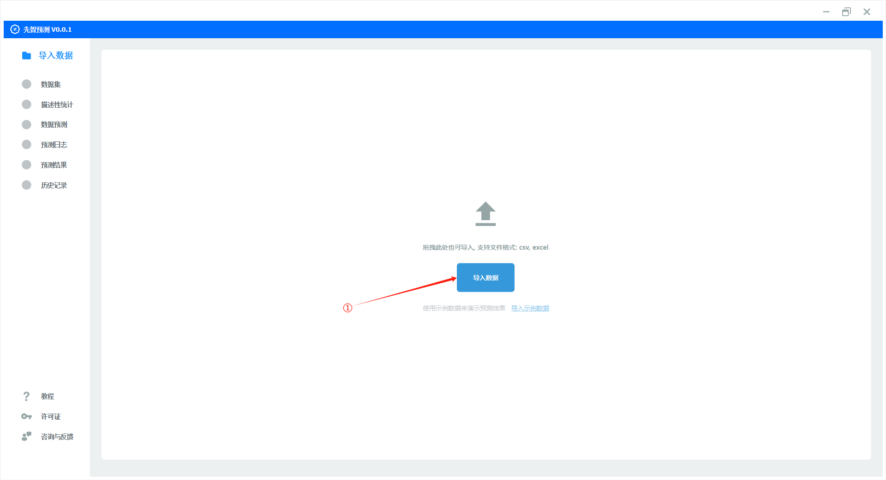
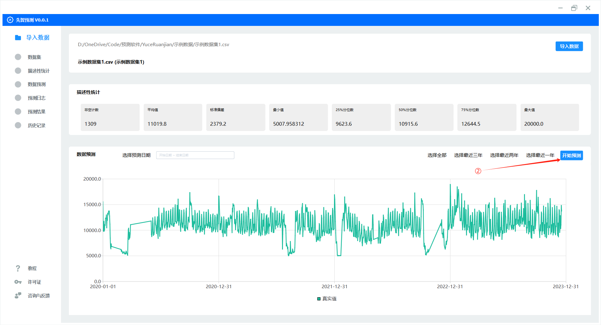

快速使用
=========

安装
----------

要安装先智预测，您仅需要下载安装包, 并安装至任意目录即可

`点击下载`_

.. _点击下载: http://guozhengjian.com/app_01/download_file/XianzhiYuceDesktop.zip/

.. admonition:: 请注意:
	:class: tip

	当前软件处于公开测试阶段。大部分杀毒软件（如360、腾讯、火绒等）检测均正常，但部分杀毒软件（如 Microsoft Defender）可能会出现误报情况。开发团队正积极与 Microsoft Defender 沟通，努力解决这一问题。如果您对此有顾虑，建议等待后续版本更新。

快速上手
----------

| 您可以使用软件内提供的 **示例数据** 来快速预览预测效果
| 具体步骤如下:

| ① 点击 **导入示例数据** 选项

| ② 选择需要导入的示例数据集
| ③ 点击 打开 将数据导入到软件中

| ④ 选择需要预测的工作簿
| ⑤ 点击 **加载** 按钮

| ⑥ 点击 **开始预测**, 即可开始预测数据

| ⑦ 当预测执行完毕后, 可以在点击左侧选项栏中的 **预测结果** 来查看本次预测的数据 
| 可以看到, 本次预测的整体精准度为 93%, 其中近一年的精度为95%
| 且精准度 ≥95% 的天数为 169 天, 占近一年天数的 46%; 
| 精准度 ≥90% 的天数为 312 天, 占近一年天数的 85%;

准备预测数据
-------------

**先智预测** 目前已经对全国所有主要城市均建立了特征数据库, 所以, 当您进行预测时, 首先需要确定您的数据中包含 **日期**, **城市**, **预测值** 3个列名称, 以便系统可以调用对应地区的特征数据为您预测. 
目前支持的城市名称请参考: :download:`城市名称列表.xlsx <_static/Excel/城市名称列表.xlsx>`

您预测数据的标题和内容应大致如下
	==========  ==========  ==========  ========== ==========
	日期         省份        城市         区县       预测值
	==========  ==========  ==========  ========== ========== 
	2022/1/1                北京市       朝阳区     10000
	2022/1/1                北京市       朝阳区     11000
	2022/1/2                北京市       朝阳区     12000
	...                     ...         ... ...
	==========  ==========  ==========  ========== ==========
其中:
	| 省份: 全国任意省份的名称; **可选**
	| 城市: 全国任意城市的名称; **必填**
	| 区县: 全国任意区县的名称; **可选**
	| 预测值: 需要预测的指标; **必填**

所以, 以下几个例子都符合数据输入要求

------

示例一
	==========  ==========  ==========  ==========
	日期         省份        城市         预测值
	==========  ==========  ==========  ========== 
	2022/1/1    河南省       郑州市      10000
	2022/1/1    河南省       郑州市      11000
	2022/1/2    河南省       郑州市      12000
	...                     ...         ...
	==========  ==========  ==========  ==========

------

示例二
	==========  ==========  ==========  ==========
	日期         省份        城市         预测值
	==========  ==========  ==========  ========== 
	2022/1/1                郑州市      10000
	2022/1/1                郑州市      11000
	2022/1/2                郑州市      12000
	...                     ...         ...
	==========  ==========  ==========  ==========

------

示例三
	==========  ==========  ==========  ==========
	日期         城市        区县         预测值
	==========  ==========  ==========  ========== 
	2022/1/1    郑州市       金水区      10000
	2022/1/1    郑州市       金水区      11000
	2022/1/2    郑州市       金水区      12000
	...                     ...         ...
	==========  ==========  ==========  ==========

------

目前软件支持导入的数据格式为: **'.csv'|'.xlsx'|'.xls'|'.xlsb'|'.xlsm'|'.odf'|'.ods'|'.odt'**

您可以下载 :download:`示例数据集 <_static/Excel/示例数据集.xlsx>` 来参考其标题规范, 然后按照示例数据来整理您的预测数据

开始预测
-----------

迫不及待了吗？在开始预测之前, 我们假设您已经准备好了预测数据. 如果还没有，去 `准备预测数据`_ 一节看看吧

如果您已经准备好了预测数据, 那么只需要执行 **导入数据**, 然后点击 **开始预测** 这两步操作即可完成预测

**先智预测** 会根据您的预测数据自动调用最佳特征库, 以及自动进行各类特征参数调优, 您只需要等待片刻即可获得预测结果

详细操作步骤如下:

① 导入数据

② 开始预测

接下来, 你只需要等待片刻, 即可获取预测结果

您也可以参考 `快速上手`_ 来使用测试数据集快速预览预测效果
