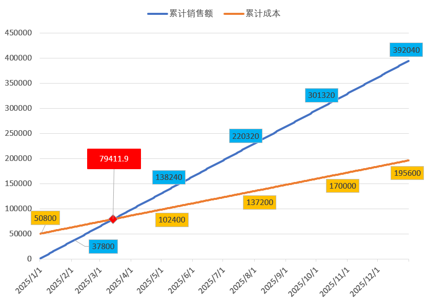

经营分析
=================

创业投资之前, 如何计算项目利润空间? (盈亏平衡分析篇)
-------------------------------------------------------------

*🙎‍♂️作者留言: 原创作品, 如需转载, 请标明出处! 谢谢😄*

你想投资一个项目, 但是你不知道这个项目是否能挣钱,  那么你应该如何对这个项目进行评估?

本期内容我会和大家分享几个适合在项目投资之前, 评估项目是否可行的一些方法

.. admonition:: 请注意:
    :class: tip
	
    1.创业有风险, 请算好账, 在投资! 

    2.普通老百姓资金有限, 做任何动作, 请反复斟酌后, 在投钱, 哪怕因为犹犹豫豫错过了机会, 也好过应激投资损失了自己的本钱!

当你看好了一个创业项目, 也通过各种渠道了解这个项目的商品售价, 开店的大概成本, 每天大概的销量后, 那你应该怎么分析这个项目是否可投呢

那首先要做的就是对项目进行 **盈亏平衡分析**, 也叫做 **保本分析** 或 **量本利分析**

这个量指的就是销量, 本指的是成本, 利指的是利润

所以首先你要计算的是, 在你开业后:
	| 1.按照当前你预估的每日销量, 需要售卖多少份商品, 你才可以回本?
	| 2.按照当前商品的售价, 你的销售额需要达到多少后才能回本?
	| 3.你应该如何定价你的商品, 参考依据是什么?
	| 4.你需要知道 最低价格低于多少时, 你会出现亏本?
	| 5.回本的周期是多久?
	| 6.在产品的生命周期内, 你的最大利润是多少?

这些未知的因素, 最好是在投资前就把他算好, 要不然等到开业后才发现项目回本期太长, 或者光有流水没有利润, 到时候在撤场就会损失很多创业基金!

分析好了项目的盈亏情况之后, 你也就大概能了解这个项目在整个市场周期内的利润空间有多大, 也就能初步评估好这个项目是否可以投资, 或者是否值得投资

那盈亏平衡分析要分析些什么呢

主要有:
	| 盈亏平衡 销售收入
	| 盈亏平衡 产量
	| 盈亏平衡 单位产品变动成本
	| 盈亏平衡 销售价格

其中:
	| 盈亏平衡销售收入用于计算: 在最低需要达到多少销售收入的情况下, 才能够不亏本
	| 盈亏平衡产量用于计算: 最低需要生产多少商品, 产生的利润才能够不亏本
	| 盈亏平衡单位产品变动成本用于计算: 每个产品的成本最高不得高于多少, 否则出现会亏损 (典型的应用场景就是计算成本应该控制在什么区间, 才能符合盈利预期 )
	| 盈亏平衡销售价格用于计算: 每个商品的最低销售价格需要达到多少, 才能够不亏本 
	

举一个例子:
	| 假设你要开一家拉面店, 你考察了一下当地的餐饮市场, 发现开一家拉面店,
	| 开业前的门店租金, 设备, 家具, 装修等固定资产费用大约需要 5 万元, 
	| 开业后, 每天的水电气,食材,人工等变动成本大约是 400 元,
	| 商圈内的竞争对手的 销售价格 中位数是18元一份, 
	| 你保守预估开业后平均每天最低可卖出60份拉面,

你市场考察的大致情况如下:
	========================================  ========== 
	项目                                       市场预估  
	========================================  ==========
	开业前的固定成本 (租金, 设备, 装修等)        50000     
	变动成本 (水电气, 食材, 人工等)              400/天     
	市场销售价格为                              18/份     
	预估日销量                                  60/份     
	========================================  ========== 

然后按照当前门店辐射范围内的消费人口数量, 你的拉面店大概在1年后会进入衰退期, 所有你想在半年内就回本, 而且1年内的净利润最好能达到每月1万元
	========================================  ========== 
	项目                                        期望
	========================================  ========== 
	预估市场生命周期为1年                        365/天
	期望回本周期                                半年
	期望收益                                    1万/月
	========================================  ========== 

那么你该如何来判断这个项目是否可投呢? 那首先就要计算的就是项目的 **盈亏平衡销售收入**

我们需要先把总销量和总成本先计算出来 (按照1年的市场生命周期):

    | 年销量: 365 * 60 = 21,900 
    | 总成本: 365 * 400 + 50000 = 196000 
    | 单位产品变动成本: (196000-50000)/21900=6.6667  ( 公式: (总成本-固定成本)/年销量 )

    | 其中: 
    |     变动成本的意思是指那些随销量变化而变化的成本, 理论上说, 你的销量越高, 那么你的单个产品的成本就越低, 这里为什么这里要减去固定成本呢, 是因为固定成本它是固定的, 它不会随着销量的变化而变化, 比如设备, 房租等, 所以计算商品变动成本的时候要去掉

有了销量和成本之后, 你就可以计算开店的 **盈亏平衡销售收入** 了

**盈亏平衡销售收入**

----------------------

用途: 计算最低需要达到多少销售收入的情况下, 才能覆盖所有成本, 从而实现盈亏平衡。

公式:
    | 盈亏平衡销售收入 = (固定成本 * 售价) / (售价-单位产品变动成本)
    | 盈亏平衡销售收入 = (50000 * 18) / (18 -  6.6667) = 79411.9983 
	
我们用图表来展示一下, 方便大家理解

图中, 蓝色线条是累计销售额, 黄色线条是累计成本, 这个销售额与成本交叉的点就是盈亏平衡点, 
当我们的销售收入到达该点时, 产生的利润刚好能覆盖掉在之前产生的所有成本

可以看到我们在4月份之前就已经回本了, 所以这里已经满足了其中一个要求

========================================  ========== ===========
项目                                        期望       实际
========================================  ========== ===========
预估市场生命周期为1年                        365/天
期望回本周期                                半年        ✅ <4个月
期望收益                                    1万/月
========================================  ========== ===========
    

你还有一个期望值, 就是每月有1万元的净利润, 所以接下来, 我们可以通过 **盈亏平衡产量** , 来计算一下市场生命周期内的总计利润是多少

**盈亏平衡产量**

-------------------------------------------------------------------------------

用途: 确定最低需要生产多少商品, 产生的利润才能覆盖所有成本, 从而实现盈亏平衡。

公式:
    | 盈亏平衡产量 = 成本/(售价-单位产品的变动成本)
    | 固定成本的盈亏平衡产量 = 50000/(18-6.6667) = 4411.7777 (份)
    | 总成本的盈亏平衡产量 = 196000/(18-6.6667)=17294.1685 (份)

我们反推一下:
    | 固定成本的盈亏平衡产量:
    |   每天销售60份, 我们可以在第 4411.7777 / 60=73.5296  天回本
    |   这 73 天我们刚好可以达到 73.5296 * 60 * 18 = 79,411.968 销售额, 与盈亏平衡收入的结果一致
    |   这 73 天的净利润是 回本天数 * (每日销量 * 售价 - 每日经营成本) 约等于 73.5296 * (60 * 18 - 400) = 50,000.128 元
    |   此时净利润 = 固定成本 也就是固定成本的盈亏平衡产量

    | 总成本的盈亏平衡产量:
    |   每天销售60份, 在第 17294.1685/60=288.2361 天的时候, 产生的利润已经可以满足全年的所有成本了, 也就是说在第 288 天之后, 产生的营业额将全部都是利润

    | 那么总利润是多少呢:
    |   全年利润公式 = (365 - 回本天数) * 每日销量 * 售价
    |   全年利润 = (365 -  288.2361) * 60 * 18 = 82,905.012
	
可以看到在每天60份的销量的情况下, 全年的净利润是 82905, 平均每月 82905/12=6908.75 是不满足每月1万元的纯收入期望的, 每月差了 10000-6908=3092 元

========================================  ========== ================
项目                                        期望       实际
========================================  ========== ================
预估市场生命周期为1年                        365/天
期望回本周期                                半年        ✅ <4个月
期望收益                                    1万/月     ❌ 6908 元/月
========================================  ========== ================

那在利润不满足预期的情况下, 你可能想通过控制一下生产成本, 来达到盈利预期, 那么你的生产成本应该控制到多少呢?

我们可以通过计算 **盈亏平衡单位产品变动成本** 来得到结果

**盈亏平衡单位产品变动成本**

-------------------------------------------------------------------------------

| 用途: 按照当前售价, 你的单位产品成本最大成本不得高于多少, 否则会亏损
| 场景: 如何控制成本, 成本控制在什么区间才能符合盈利预期 

公式:
    | 盈亏平衡单位产品变动成本 = 市场价格 - (成本 / 年销量)
    | 固定成本的盈亏平衡产品变动成本 = 18 - (50000 / 21900) = 15.7169 
    | 总计成本的盈亏平衡产品变动成本 = 18 - (196000 / 21900) = 9.0502 

解释:
    | 如果单个产品变动成本高于 15.7169 元时, 那么你即使经营了1年, 产生的利润也不足以覆盖 固定成本。这意味着在这种情况下你会出现亏本
    | 如果单个产品变动成本高于 9.0502 元时, 那么你即使经营了1年, 产生的利润也不足以覆盖 总计成本。这意味着在这种情况下你会出现亏损

我们可以反推一下:
    | 反推公式: (售价 - 变动成本) * 年销量
    | (18- 15.7169)*21900=49999.89  约等于 5 万元的固定成本
    | (18- 9.0502)*21900=196000.62  约等于 19.6 万元的全年成本
	
	
那单个商品的变动成本应该控制在多少, 才能实现每月 1 万元的净利润呢, 我们可以通过

公式:
    | 目标收益的单位产品变动成本 = (每月销售额 - 每月总成本 - 每月期望利润) / 月销量
    | 目标收益的单位产品变动成本 = (21900/12*18 - 196000/12-10000) / (21900/12) = 3.5708 

所以, 月利润1万元的单位产品变动成本为 3.5708 元

我们反推一下:
    | 每月净利润 = (售价 - 单位产品变动成本) * 每月销量 - 每月总成本
    | 每月净利润 = (18 - 3.5708) * (21900/12) - (196000/12) = 9999.9567

也就是说:
	| 当你的单位产品成本低于 9.05 元时, 你可以确保盈利, 但是盈利不会达到预期
	| 当你的单位产品成本控制在 3.57 元时, 你可以实现每月 1 万元的净利润期望

========================================  ================== ======================
项目                                        期望               实际
========================================  ================== ======================
预估市场生命周期为1年                        365/天
期望回本周期                                半年                ✅ <4个月
期望收益                                    1万/月             ❌ 6908 元/月
期望收益-生产成本                           6.6667 > 9.0502     ✅ 符合预期
期望收益-生产成本                           控制在 3.5708 元    😄 每月净利润为1万元
========================================  ================== ======================

所以通过计算 **盈亏平衡单位产品变动成本**, 你就能对成本调整就有一个参考依据

你可以在投资之前, 先评估好自己是否可以将成本控制在计算范围内, 如果不能的话, 你将无法实现预期收益!
	
算好了成本的控制的区间后, 你该怎么如何给商品定价呢, 参考依据是什么?

所以你还需要计算 **盈亏平衡销售价格** 来确定定价区间

**盈亏平衡销售价格**

-------------------------------------------------------------------------------

用途: 确定单位产品的销售价格最低需要达到多少才能覆盖所有成本 (固定成本和变动成本), 从而实现盈亏平衡。

公式:
	| 盈亏平衡销售价格 = 总成本 / 年销量
	| 盈亏平衡销售价格 = 196000 / 21,900 = 8.9498 

解释:
	| 在总成本 196000 元的成本结构下, 每份产品的售价需要至少为 8.94 元, 才能刚好覆盖所有成本, 实现盈亏平衡。
	| 如果售价低于这个价格, 你将出现亏损。

========================================  ================== ======================
项目                                        期望               实际
========================================  ================== ======================
预估市场生命周期为1年                        365/天
期望回本周期                                半年                ✅ <4个月
期望收益                                    1万/月             ❌ 6908 元/月
期望收益-生产成本                           6.6667 > 9.0502     ✅ 符合预期
期望收益-生产成本                           控制在 3.5708 元    😄 每月净利润为1万元
期望收益-销售价格                           18 > 8.9498	        ✅ 符合预期
========================================  ================== ======================

上述案例是为了方便大家理解盈亏平衡分析, 举得一个简单的例子, 
现实情况中肯定会比这复杂的多, 比如现实中你的营业数据肯定不可能是线性的, 今天卖60份, 明天还是卖60份, 
但不管是开业中, 还是创业投资前, 我们都可以使用盈亏平衡分析, 来观察目前经营处于什么阶段, 销售,收入,成本是否符合你的预期, 
尤其是在投资之前, 更加需要先计算投资项目的盈亏平衡情况之后, 在决定是否要进行投资!

盈亏平衡分析的公式都很简单, 口算快的甚至能直接口算出来, 这些计算方法大家可以去我的个人文档中, 复制出来当笔记, 我个人文档的地址是: `www.xianzhiyuce.com/doc <https://www.xianzhiyuce.com/doc>`_

这里顺便推一下我个人开发的一款预测软件, 预测可以很好的帮你把控经营节奏, 比如 如何安排生产销售计划, 如何安排人员排班, 如何管理库存等, 预测软件针对全国所有省市区县都做了特征数据库, 最多支持未来15天预测, 非常适合餐饮, 快速消费品等行业的销售或生产预测,  下载地址是 `www.xianzhiyuce.com <https://www.xianzhiyuce.com>`_, 推荐大家使用!

好了这就是本期的所有内容, 下期我会继续讲一些关于 **项目投资分析** 相关的内容, 感兴趣的可以持续关注, 感谢您的观看, 再见

本文章已发布视频至: `哔哩哔哩~bilibili <https://www.bilibili.com/video/BV1JWk3YLESj/?vd_source=10827ebdd042ef5aac4731b819de92dc>`_

内部收益率分析
--------------
正在更新, 请持续关注!

资金的时间价值
--------------
正在更新, 请持续关注!

